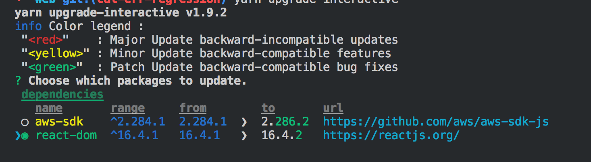

### Updating Package Dependencies



## The upgrade process

1. Run

```bash
yarn upgrade-interactive --latest
```

> Follow the on-screen instuctions for selecting packages.

2. Select and apply all the Patch updates (**green**)

3. Run the tests

```bash
yarn test
yarn ci:dev
```

4. If the test all pass proceed to update Minor updates (**yellow**) -> Run tests -> Major updates (**red**) -> Run tests

5. Submit a Pull Request with the updates

<hr>

Note: Ensure the --latest flag is passed or the updates will not be saved to the package.json file

## Vulnerability process

1. Review [cds-snc/ircc-rescheduler:web/package.json](https://app.snyk.io/org/cds-snc/project/c460a004-28e3-4600-96a3-593e82247cce/)
2. If vulnerability detected then attempt to resolve.
3. If vulnerability has no fix, then ignore for 30 days or escalate with security team.
4. If vulnerability is not exploitable and poses no risk to the system then ignore for 30 days.